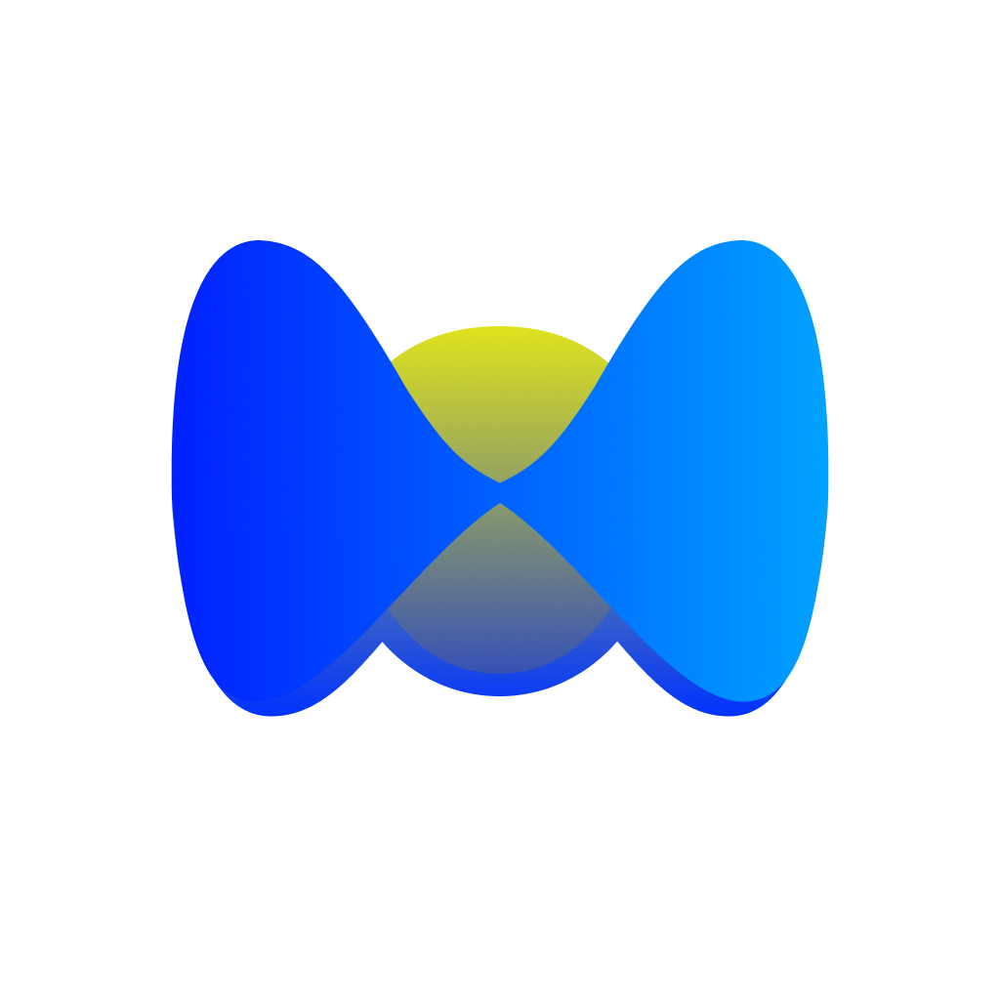

<div align="center">



# Math Visual AI

### AI-Powered Mathematical Shape Visualizer via Telegram Bot

[](https://github.com/devbexruz/math_visual_bot)
[](LICENSE)
[](https://python.org)
[](https://fastapi.tiangolo.com)
[](https://react.dev)
[](https://typescriptlang.org)
[](https://threejs.org)
[](https://t.me/MathVisualBot)
[](https://ai.google.dev)

---

**Math Visual AI** is an intelligent Telegram bot that transforms natural language descriptions into interactive 2D and 3D mathematical visualizations. Simply describe a shape in text or voice — the AI does the rest.

| [**Try the Weebsite →**](https://iqromin.uz) | [**Try the Bot →**](https://t.me/MathVisualBot) |

</div>

---

## 📑 Table of Contents

- [Features](#-features)
- [Tech Stack](#-tech-stack)
- [Architecture](#-architecture)
- [Supported Shapes](#-supported-shapes)
- [Installation & Setup](#-installation--setup)
- [Usage](#-usage)
- [API Reference](#-api-reference)
- [Contributing](#-contributing)
- [License](#-license)
- [Author](#-author)

---

## ✨ Features

- **🤖 AI-Powered Generation** — Describe any mathematical shape in natural language and Google Gemini AI interprets it into precise parameters
- **🎙️ Voice Input** — Send voice messages to the Telegram bot; Gemini transcribes and processes them automatically
- **📐 2D Visualizations** — Lines, ellipses, parabolas, hyperbolas, and points rendered on an interactive HTML5 Canvas with grid & axes
- **🧊 3D Visualizations** — Hyperboloids, ellipsoids, cones, paraboloids, planes, cubes, and more rendered with Three.js + WebGL
- **⚡ Real-Time Editing** — Adjust shape parameters (size, color, position) with drag-to-change controls and see instant updates
- **📱 Fully Responsive** — Works seamlessly on mobile, tablet, and desktop
- **🔐 Token-Based Auth** — Secure user sessions with unique tokens across devices

---

## 🛠 Tech Stack

<table>
<tr>
<td align="center" width="50%">

### Backend

</td>
<td align="center" width="50%">

### Frontend

</td>
</tr>
<tr>
<td valign="top">

| Technology | Purpose |
|:--|:--|
|  | Core language |
|  | Async web framework |
|  | Async ORM (SQLite) |
|  | Telegram Bot API |
|  | AI shape generation |
|  | Data validation |

</td>
<td valign="top">

| Technology | Purpose |
|:--|:--|
|  | UI framework |
|  | Type safety |
|  | Build tool |
|  | 3D rendering |
|  | Client routing |
|  | 2D rendering |

</td>
</tr>
</table>

---

## 🏗 Architecture

```
User ──► Telegram Bot (text/voice)
              │
              ▼
        Google Gemini AI
        (interpret → JSON)
              │
              ▼
        FastAPI Backend
        (store shapes in DB)
              │
              ▼
        React Web App
        (render 2D/3D visualization)
```

**Flow:**
1. User sends a text or voice message to the Telegram bot
2. Gemini AI interprets the request and returns structured shape data (JSON)
3. Backend stores the workspace and shapes in SQLite database
4. Bot sends an inline button linking to the web visualization
5. Frontend renders interactive 2D (Canvas) or 3D (Three.js/WebGL) scenes

---

## 📊 Supported Shapes

### 3D Shapes

| Shape | Equation |
|:--|:--|
| **Ellipsoid** | $\frac{x^2}{a^2} + \frac{y^2}{b^2} + \frac{z^2}{c^2} = 1$ |
| **Hyperboloid (1-sheet)** | $\frac{x^2}{a^2} + \frac{z^2}{b^2} - \frac{y^2}{c^2} = 1$ |
| **Hyperboloid (2-sheet)** | $-\frac{x^2}{a^2} - \frac{y^2}{c^2} + \frac{z^2}{b^2} = 1$ |
| **Cone** | $\frac{x^2}{a^2} + \frac{y^2}{b^2} - \frac{z^2}{c^2} = 0$ |
| **Elliptic Paraboloid** | $z = \frac{x^2}{a^2} + \frac{y^2}{b^2}$ |
| **Hyperbolic Paraboloid** | $z = \frac{x^2}{a^2} - \frac{y^2}{b^2}$ |
| **Plane** | $ax + by + cz + d = 0$ |
| **Cube** | Rectangular parallelepiped with position & scale |
| **Dot** | Point in 3D space |

### 2D Shapes

| Shape | Equation |
|:--|:--|
| **Line** | $y = kx + b$ |
| **Ellipse / Circle** | $\frac{(x - c_x)^2}{a^2} + \frac{(y - c_y)^2}{b^2} = 1$ |
| **Parabola** | $y = ax^2 + bx + c$ |
| **Hyperbola** | $y = \frac{k}{x + b} + c$ |
| **Dot** | Point on 2D plane |

---

## 🚀 Installation & Setup

### Prerequisites

- **Python** 3.10+
- **Node.js** 18+
- **Telegram Bot Token** ([create via BotFather](https://t.me/BotFather))
- **Google Gemini API Key** ([get from AI Studio](https://aistudio.google.com/apikey))

### 1. Clone the Repository

```bash
git clone https://github.com/devbexruz/math_visual_bot.git
cd math_visual_bot
```

### 2. Backend Setup

```bash
cd backend
pip install -r requirements.txt
```

Create a `.env` file in the `backend/` directory:

```env
DATABASE_URL=sqlite+aiosqlite:///./math_visual.db
SECRET_KEY=your-secret-key
BOT_TOKEN=your-telegram-bot-token
GEMINI_API_KEY=your-google-gemini-api-key
WEBHOOK_HOST=https://your-domain.com
WEBHOOK_PATH=/api/webhook
GEMINI_MODEL=gemini-3.1-flash-lite-preview
```

Start the backend server:

```bash
uvicorn app.main:app --reload
```

> The API will be available at `http://localhost:8000`. Swagger docs at `http://localhost:8000/docs`.

### 3. Frontend Setup

```bash
cd frontend
npm install
npm run dev
```

> The frontend will be available at `http://localhost:5173`. API requests are automatically proxied to the backend.

---

## 📖 Usage

### Via Telegram Bot

1. Open [@MathVisualBot](https://t.me/MathVisualBot) in Telegram
2. Send a message describing the shape you want, for example:

   ```
   Draw an ellipsoid with a=3, b=2, c=4 in red color
   ```

3. Or send a **voice message** describing the shape
4. The bot will generate the shape and send a **"View"** button
5. Click the button to open the interactive web viewer

### Via Web Interface

1. Open the web app and log in through the Telegram bot
2. Browse your saved workspaces on the home page
3. Use the **AI input box** at the bottom to generate new shapes
4. Click any workspace card to open the full visualization editor
5. **3D**: Rotate (left-click drag), Zoom (scroll), Pan (right-click drag)
6. **2D**: Pan (drag), Zoom (scroll wheel)
7. Edit shape parameters in the right panel — changes apply in real-time

---

## 📡 API Reference

All endpoints are prefixed with `/api`. Authentication via `Authorization: Bearer <token>` header.

| Method | Endpoint | Description |
|:--|:--|:--|
| `POST` | `/users/auth` | Register / login with Telegram ID |
| `GET` | `/users/me` | Get current user info |
| `GET` | `/workspaces/` | List all workspaces |
| `POST` | `/workspaces/` | Create a new workspace |
| `GET` | `/workspaces/{id}` | Get workspace details |
| `DELETE` | `/workspaces/{id}` | Delete a workspace |
| `GET` | `/workspaces/{id}/shapes/` | List shapes in a workspace |
| `POST` | `/workspaces/{id}/shapes/` | Add a shape to a workspace |
| `DELETE` | `/workspaces/{id}/shapes/{shape_id}` | Delete a shape |
| `POST` | `/ai/generate` | Generate shapes from natural language prompt |

> Full interactive API documentation is available at `/docs` (Swagger UI) when the server is running.

---

## 🤝 Contributing

Contributions are welcome! Here's how to get started:

1. **Fork** the repository
2. **Create** a feature branch:
   ```bash
   git checkout -b feature/amazing-feature
   ```
3. **Commit** your changes:
   ```bash
   git commit -m "Add amazing feature"
   ```
4. **Push** to the branch:
   ```bash
   git push origin feature/amazing-feature
   ```
5. **Open** a Pull Request

### Guidelines

- Follow existing code style and conventions
- Write clear commit messages
- Test your changes before submitting
- Update documentation if needed

---

## 📄 License

This project is licensed under the **MIT License** — see the [LICENSE](LICENSE) file for details.

```
MIT License

Copyright (c) 2026 Boynazarov Bexruz

Permission is hereby granted, free of charge, to any person obtaining a copy
of this software and associated documentation files (the "Software"), to deal
in the Software without restriction, including without limitation the rights
to use, copy, modify, merge, publish, distribute, sublicense, and/or sell
copies of the Software...
```

---

## 👤 Author

<table>
<tr>
<td align="center">

**Boynazarov Bexruz**

[](https://github.com/devbexruz)

</td>
</tr>
</table>

---

<div align="center">

**⭐ If you found this project useful, please consider giving it a star!**

Made with ❤️ by [Boynazarov Bexruz](https://github.com/devbexruz)

</div>
